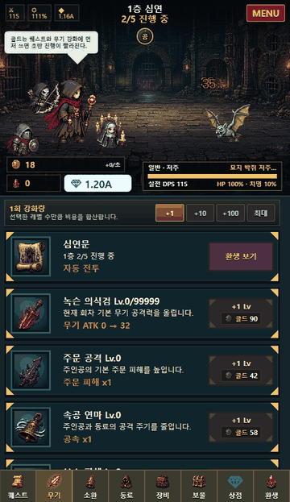
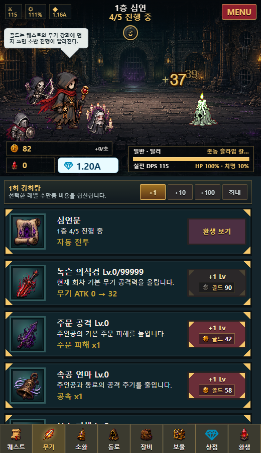
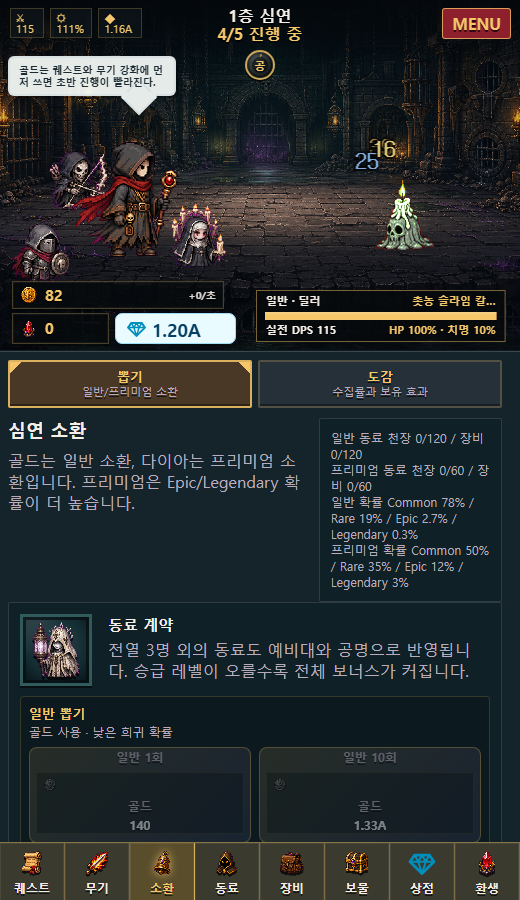
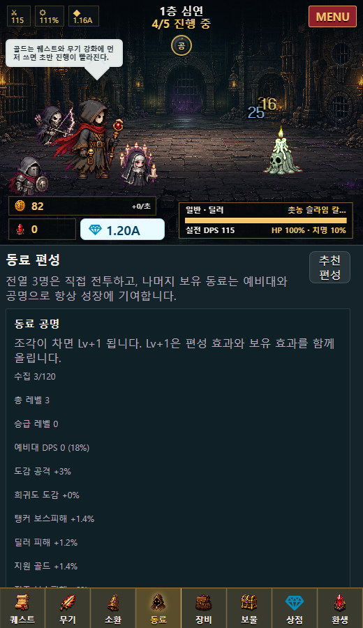

# 심연의 무명소환사 (Abyss Summoner)

심연의 층을 자동으로 돌파하며 동료를 소환하고 장비를 맞추는 다크 판타지 방치 성장 RPG입니다. 플레이어는 보스에게 막힐 때마다 강화, 소환, 환생 중 다음 성장 방향을 선택해 더 깊은 층으로 내려갑니다.

**바로 플레이하기:** https://meowthologysaga.github.io/abyss-summoner/

<p align="center">
  
</p>

<p align="center">
  
  
  
</p>

## 한눈에 보기

- 장르: 세로형 모바일 방치 RPG
- 핵심 재미: 자동 전투, 성장 선택, 동료/장비 소환, 보스 돌파, 환생
- 실행 방식: 앱 없이 브라우저에서 바로 실행 가능한 독립 웹 게임
- 사용 기술: HTML, CSS, JavaScript, Canvas, 로컬 mock Host API

## 게임 소개

플레이어는 심연을 탐험하는 무명 소환사가 됩니다. 전투는 자동으로 진행되고, 플레이어는 골드와 영혼석을 모아 무기, 주문, 보물, 동료, 장비를 강화합니다. 보스에서 막히면 환생으로 장기 성장을 쌓고 다시 더 높은 층을 도전합니다.

```text
자동 전투
  -> 재화 획득
  -> 강화와 소환
  -> 보스 돌파
  -> 환생
  -> 더 높은 층 도전
```

## 만든 이유

원래 이 프로젝트는 Language Miner의 PlayZone Game Pack 실험에서 출발했습니다. Language Miner는 학습 활동으로 `다이아`를 얻는 앱이고, PlayZone은 그 보상을 별도 게임에서 쓰게 만드는 방향의 기능입니다.

이 게임은 "학습 문제를 게임처럼 포장한 화면"이 아니라, 학습 보상이 쓰일 만한 독립적인 게임을 먼저 만드는 실험입니다. 그래서 게임 안에는 퀴즈를 억지로 넣지 않고, 일반 모바일 RPG처럼 성장과 수집, 선택적 프리미엄 소비 구조를 구현했습니다.

## 구현 특징

- 짧은 세션에서도 성장감이 보이는 방치 RPG 루프 설계
- 전투 화면, 하단 탭, 상점, 소환, 편성 화면까지 이어지는 모바일 UI 구성
- 스프라이트, 배경, 아이콘을 모바일 전투 화면에 맞게 정리하고 적용
- 앱 본체와 게임을 분리해, 게임만 단독으로 실행 가능한 구조 설계
- 다이아 차감, 저장, 알림 같은 앱 연동 지점을 mock Host API로 분리
- 공개 저장소 배포를 고려한 민감정보와 파일 경로 검수

## 주요 기능

- 층 단위 자동 전투와 보스 반복 도전
- 골드 강화, 영혼석 보물, 환생 기반 장기 성장
- 동료/장비 소환, 희귀도, 천장, 중복 조각, 승급
- 동료 편성, 장비 장착, 몬스터/아이템 카탈로그
- 다이아 상점, 스킨 해금, 소모품, 영구 특수능력
- 브라우저 저장과 mock 지갑을 이용한 독립 실행 프리뷰

## 스크린샷

| 전투/성장 | 소환 | 동료 편성 | 상점 |
| --- | --- | --- | --- |
|  |  |  |  |

## 실행 방법

GitHub Pages가 활성화되어 있으면 아래 링크에서 바로 실행됩니다.

```text
https://meowthologysaga.github.io/abyss-summoner/
```

브라우저에서 아래 파일을 열면 바로 실행됩니다.

```text
abyss-summoner/game/index.html
```

정적 서버로 실행할 수도 있습니다.

```bash
python -m http.server 3000 --bind 127.0.0.1
```

```text
http://127.0.0.1:3000/game/index.html
```

탭별 화면은 hash로 바로 열 수 있습니다.

```text
game/index.html#summon
game/index.html#heroes
game/index.html#shop
```

## 보안 검수

공개 저장소 배포를 기준으로 GitHub 히스토리와 현재 작업트리를 검사했습니다.

- API 키, 토큰, 비밀번호, private key 없음
- 이메일, 전화번호, 주민번호 패턴 없음
- 로컬 사용자 폴더 절대경로 없음
- 외부 네트워크 사용 없음
- `.static-server.*.log`는 `.gitignore`로 제외

자세한 검수 내용은 [security-report.md](security-report.md)에 정리했습니다.

## 프로젝트 구조

```text
abyss-summoner/
  manifest.json
  README.md
  security-report.md
  GDD.md
  game/
    index.html
    main.js
    styles.css
    host-adapter.js
    mock-host.js
  assets/
    screenshots/
    generated/
    audio/
  economy/
    diamond-actions.json
  tools/
    generate_audio_assets.py
```

## 현재 상태

현재 버전은 브라우저에서 바로 실행되는 플레이어블 프로토타입입니다. Language Miner의 실제 PlayZone 런타임이 없어도 단독으로 실행되며, 앱 연동부는 mock Host API로 대체되어 있습니다.
